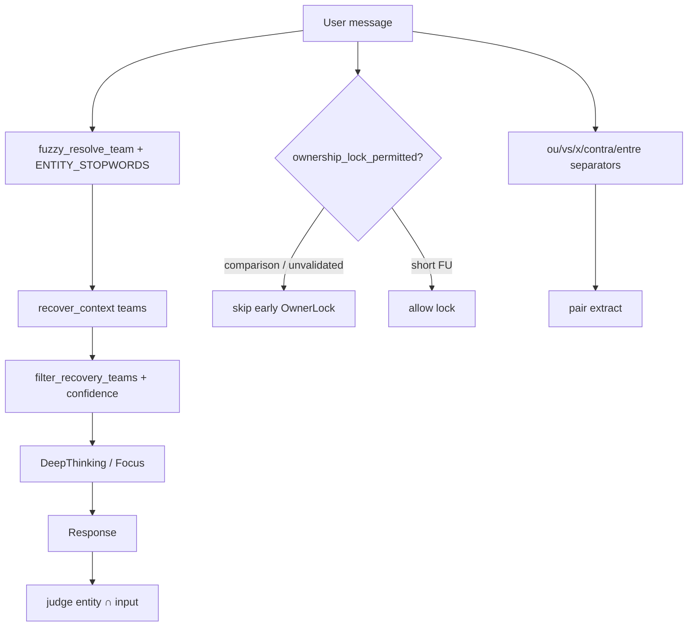

# AURORA-PATCH-001 — Entity Safety Layer

**MODE:** DESIGN_AND_IMPLEMENTATION  
**STATUS:** Implemented (local SoT)

---

## 1. Architecture proposal

### Design answers

| Q | Decision |
|---|----------|
| Where? | **Multi-layer choke points**: (1) `fuzzy_resolve_team` stopword gate, (2) post-recovery `filter_recovery_teams`, (3) ownership claim gate, (4) pair separators, (5) judge overlap |
| Single vs multi? | **Multi-layer** — FOUNDATION-002 showed ≥12 entry points; single gate is insufficient |
| Confidence thresholds? | `HIGH≥0.85`, `MED≥0.55`, `LOW=0.43`, drop `<0.35`. Bare `atletico`: Mineiro **0.91** with BR cues / Madrid **0.43**; EU cues inverted |
| Rollback? | Fail-open try/except on every wire; exact slang aliases unchanged; feature is additive |
| Performance? | O(tokens × typo_keys) unchanged + tiny stopword set lookup; no network |



### Layers

1. **R1 Stopwords** — `entity_safety.ENTITY_STOPWORDS` blocks fuzzy only; exact `_TYPO_TEAMS` (chape/bota/…) preserved.  
2. **R2 Confidence** — `score_alias_hit` / notes `entity_conf:Canon=0.xx`.  
3. **R3 Ownership** — comparisons cannot early-lock; `OwnerLock: BLOCKED pending entity validation`.  
4. **R4 Judge** — ungrounded central entity → penalties + overall cap **≤4.5** (no Boa/HIGH).  
5. **R5 Operators** — `ou|entre|contra` in nl_router / CUE / HIE / recovery pair regex + comparison phrase helper.

---

## 2. Files impacted

| File | Change |
|------|--------|
| `src/conversation/entity_safety.py` | **NEW** — stopwords, confidence, filter, overlap, ownership gate |
| `src/conversation/context_recovery.py` | Block fuzzy stopwords; pair `ou/contra/entre`; filter teams |
| `src/core/nl_router.py` | `_SEP_RE` += ou\|entre |
| `src/conversation/conversational_understanding.py` | pair regex += ou\|contra\|entre |
| `src/conversation/human_inference.py` | pair regex += ou\|contra\|entre |
| `src/conversation/ownership_stability.py` | Block claim on comparisons |
| `src/conversation/judge_rubric.py` | Entity∩input + overall cap |
| `tests/test_entity_safety_patch001.py` | **NEW** — R1–R5 tests |

---

## 3. Implementation plan (done)

1. Add `entity_safety.py`  
2. Harden `fuzzy_resolve_team` + recovery filter  
3. Extend separators  
4. Gate ownership  
5. Judge grounding  
6. Tests + smoke  

---

## 4. Migration risks

| Risk | Mitigation |
|------|------------|
| Over-blocking legitimate fuzzy typos | Exact `_TYPO_TEAMS` still wins first |
| `sport`/`real` as EN words | Alias path unchanged (anti-regression); only fuzzy blocked if listed |
| Comparison lock too strict | Short FU (`≤4` tokens, non-compare) still locks |
| Fail-open skips safety | Logged via notes `entity_safety_skip:` |

---

## 5. Regression risks

| Area | Risk | Status |
|------|------|--------|
| Live analysis | Separators additive only | Low |
| Memory / short FU | Ownership still allowed for short FU | Low |
| Aliases | TEAM_ALIASES untouched | Low |
| Exact slang (bota/chape) | Explicitly preserved | Covered by tests |
| Web weave test | Pre-existing unrelated fail | Out of scope |

---

## 6. Test plan

| Case | Expect |
|------|--------|
| `fuzzy_resolve_team("chance")` | `None` |
| recover `"…chance… atlético ou bahia"` | no Chapecoense; Bahia + Mineiro |
| `Atlético ou Bahia` | both teams extracted |
| Judge payload team=Chapecoense vs that user msg | overall ≤4.5 |
| Smoke `/aurora/copilot` same msg | Chapecoense absent |

Command:

```bash
PYTHONPATH=artifacts/aurora pytest artifacts/aurora/tests/test_entity_safety_patch001.py -q
```

---

## Success criteria check

| Criterion | Result |
|-----------|--------|
| `chance` never → Chapecoense | **PASS** (unit + smoke) |
| Wrong entities cannot contaminate via fuzzy stopwords | **PASS** at recovery; residual paths (calendar/memory) remain monitored |
| Judge cannot HIGH with wrong central entity | **PASS** (cap 4.5) |
| Comparisons `Atlético ou Bahia` | **PASS** (recover + separators) |
